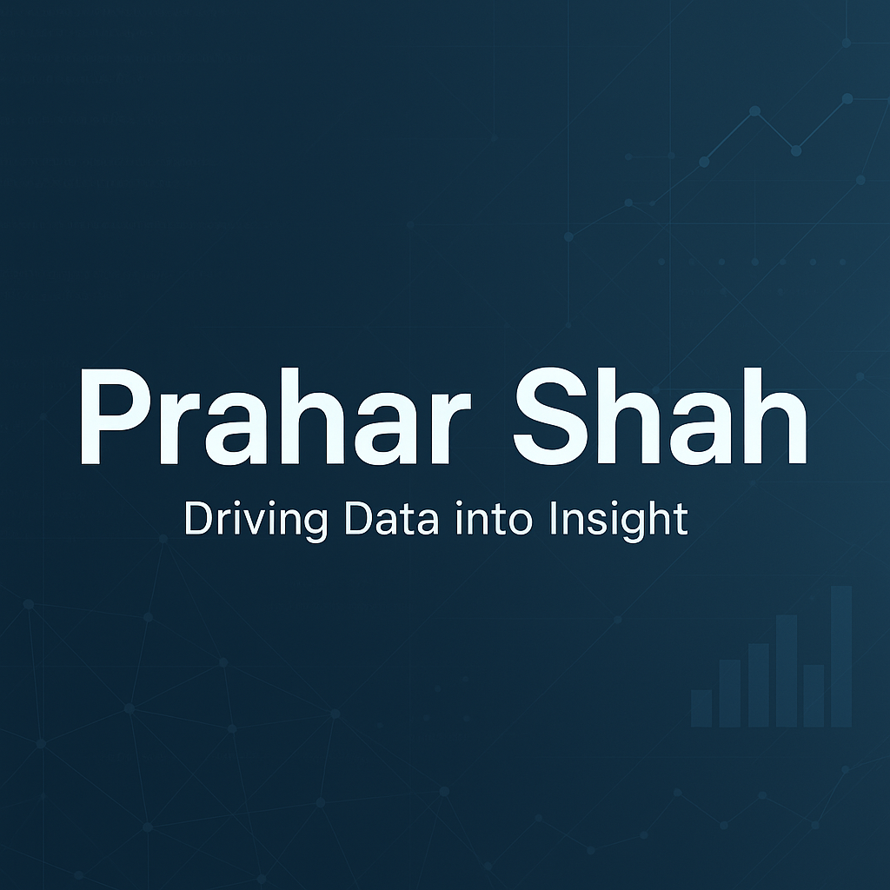

  

---

## 👋 Hello! Welcome to my data-driven corner of GitHub

I'm **Prahar Shah**, a passionate **Data Analyst** based in Toronto who loves turning complex datasets into meaningful business insights. Whether it's wrangling unstructured data, automating reporting pipelines, or building machine learning models—I’m always on the hunt for ways to **optimize decision-making through analytics**.

---

### 🧠 About Me
📍 Currently in Toronto, ON  
🎓 Master's in Data Analytics (Applied Machine Learning major) – Northeastern University  
🔍 Focused on: **Data Validation**, **Pipeline Automation**, **Business Intelligence**, and **ML Applications**  
🧰 Tools of the trade: SQL, Python, Power BI, Databricks, Azure, TensorFlow  
💡 I believe in: *"Clean data > more data."*

I love translating raw numbers into visual stories and actionable strategies—whether that’s predicting revenue trends or detecting anomalies in real time.

---

### 📊 What I Do
- Build scalable **ETL pipelines** that ensure consistent data quality and availability  
- Design **automated BI dashboards** to make financial and operational metrics crystal clear  
- Develop **machine learning models** for classification, regression, and anomaly detection  
- Contribute to **cross-functional teams**, transforming ambiguous problems into elegant data products  
- Perform **data audits** to identify risks, clean inconsistencies, and reinforce governance

---

### 🔧 Tech Stack & Tools

| 📌 Data & Programming | 📈 Analytics & BI | ☁️ Cloud & DevOps |
|----------------------|------------------|-------------------|
| Python, R, SQL       | Power BI, Tableau| Azure, AWS, GCP   |
| PL/SQL, NoSQL        | Excel (Advanced) | Databricks, Apache|
| TensorFlow, Scikit   | Qlik Sense       | Git, Agile, Kanban|
| Pandas, NumPy        | R Studio         | MLflow, Synapse   |

---

### 🏅 Certifications
- **British Airways Data Science Simulation**  
  *Scraped and analyzed customer review data to model purchase behavior.*

- **Accenture NA: Data Analytics & Visualization**  
  *Designed interactive dashboards and cleaned complex datasets in SQL & Power BI.*

---

### 📬 Let’s Connect
📎 [LinkedIn](https://www.linkedin.com/in/praharshah/)  
👨‍💻 [GitHub](https://github.com/prahar0505)  
✉️ shahprahar05@gmail.com  

---

### 💬 Fun Fact  
I’m equally obsessed with cleaning messy datasets and perfectly organizing my Spotify playlists.  

